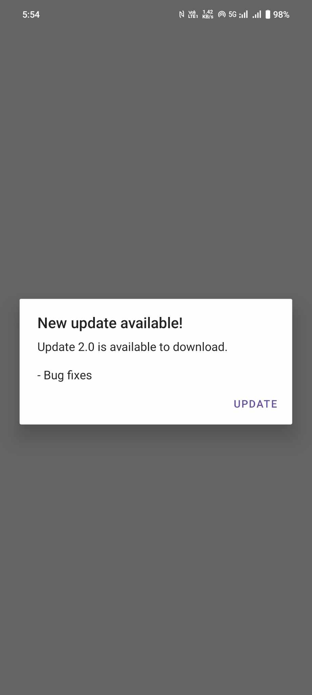

# Radz App Updater 2024

[](https://jitpack.io/#Radzdevteam/artifact)

Radz App Updater 2024 is an Android library that helps developers to keep their apps up-to-date by checking for updates automatically. It fetches the latest version details from a provided JSON file and prompts the user to update the app if a new version is available.




## How to Include

### Step 1. Add the repository to your project settings.gradle:

```groovy
dependencyResolutionManagement {
    repositoriesMode.set(RepositoriesMode.FAIL_ON_PROJECT_REPOS)
    repositories {
        google()
        mavenCentral()
        maven { url = uri("https://jitpack.io") }
    }
}
   ```

### Step 2. Add the dependency
```groovy
dependencies {
     implementation ("com.github.Radzdevteam:artifact:1.1")
}
   ```

## Usage

In your `MainActivity`, add the following code to check for updates:
```groovy
 new RadzUpdater(this, "https://radzvpn.com/raw?id=128").checkForUpdates();
   ```

## JSON Format

The JSON file at the provided URL should have the following format:
```groovy
{
  "latestVersion": "3.0.1",
  "url": "https://github.com/Radzdevteam/RadzUpdater2024/radzupdater.apk",
  "releaseNotes": [
    "- Bug fixes"
  ]
}
   ```


